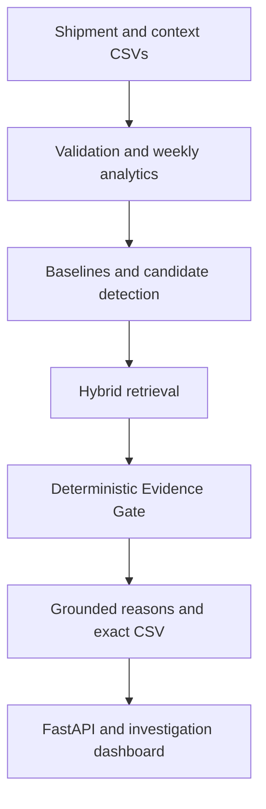

# FreightGuard AI

An evidence-first freight-cost anomaly investigation system that detects unusual
route-level cost increases, tests whether supplied business context genuinely
explains them, and produces a reproducible, audit-ready CSV.

| Evaluation status | Verified result |
|---|---|
| Repository status | Evaluation-ready in deterministic template mode |
| Output contract | Exact supplied eight-column CSV schema |
| Reproducibility | Three isolated runs produced byte-identical canonical CSVs |
| Hosted model dependency | None in the default template workflow |
| Formal evaluation | PASS: 109/109 checks across 13 domains |

## The problem

Freight costs can rise for legitimate reasons, but a similar-looking increase may
also lack supporting context. FreightGuard compares every directional route with
its own history and with same-week routes of the supplied route type. It then
retrieves potentially relevant notes and applies deterministic evidence checks.
Similarity alone never clears an anomaly, and the system never invents evidence
outside the supplied notes.

## What the system does

1. Validates shipment, context-note, and output-contract CSVs.
2. Assigns shipments to Monday-through-Sunday weeks.
3. Calculates weighted route-week cost per tonne-kilometre.
4. Computes the prior eight available route observations as own history.
5. Computes a same-week peer average excluding the current route.
6. Applies a configurable deterministic candidate rule.
7. Retrieves potentially relevant context with sparse and dense search.
8. Applies route, date, direction, cost-impact, negation, and scope gates.
9. Produces grounded template wording without changing decisions.
10. Writes the exact required CSV and exposes the result through FastAPI and React.

## Why the result is trustworthy

| Concern | Authority |
|---|---|
| Weekly mathematics | Deterministic analytics |
| Candidate detection | Configured deterministic rule |
| Note retrieval | Hybrid retrieval; candidate discovery only |
| Evidence acceptance | Deterministic Evidence Gate |
| Verdict and matched note | Deterministic decision layer |
| Explanation wording | Template or constrained provider over validated facts |
| Operational leads | Diagnostic only; never verdict authority |
| Assistant answers | Read-only snapshot tools and verified citations |

The complete requirement map is in
[Case-study traceability](docs/CASE_STUDY_TRACEABILITY.md).



## Verified supplied-data result

The latest complete template run processed:

- 2,940 shipment records across seven directional routes.
- 728 route-week records.
- 19 anomaly candidates.
- 3 justified, 12 partially explained, and 4 unexplained verdicts.

The authoritative output is
[`backend/data/output/final_submission.csv`](backend/data/output/final_submission.csv).
It contains 19 rows and has SHA-256
`73fad5f7244fe4e016dee055b96da98d90107da93fdd46d09b092a1975d678f7`.

## Quick start

Verified on Microsoft Windows 10.0.26200 (AMD64) with Python 3.12.6,
Node.js 22.19.0, and npm 10.9.3.
Python 3.12 and Node 20.19 or newer are the supported local baseline. Internet
access is needed for first-time dependency and embedding-model installation; the
prepared default template workflow is network-free.

From the repository root in PowerShell:

```powershell
python -m venv .venv
.\.venv\Scripts\python.exe -m pip install -r backend\requirements-dev.txt
.\.venv\Scripts\python.exe -m backend.scripts.prepare_embedding_model
npm.cmd --prefix frontend install
Copy-Item .env.example .env  # optional; defaults already select template mode
```

The embedding model is revision-pinned and loaded locally during normal runs.
Do not add a real API key for the default evaluation path.

## Run the analysis

The canonical command reads the three CSVs under `backend/data/input/`, validates
the existing formal report, and writes the final output:

```powershell
.\.venv\Scripts\python.exe -m backend.scripts.generate_final_submission
```

If inputs, configuration, or code affecting the formal fingerprint changed, first
regenerate evaluation evidence:

```powershell
.\.venv\Scripts\python.exe -m backend.scripts.evaluate_pipeline --runs 3 --mode template
.\.venv\Scripts\python.exe -m backend.scripts.generate_final_submission
```

Generate the one-run usage summary from the completed audit:

```powershell
.\.venv\Scripts\python.exe -m backend.scripts.report_run_usage
```

## Verify the submission

```powershell
# Backend quality and contracts
.\.venv\Scripts\python.exe -m ruff check backend
.\.venv\Scripts\python.exe -m pytest backend/tests -q

# Exact CSV and supplied-data integration checks
.\.venv\Scripts\python.exe -m pytest backend/tests/integration/test_final_submission_supplied_data.py -q

# Formal evaluation and three isolated reproducibility runs
.\.venv\Scripts\python.exe -m backend.scripts.evaluate_pipeline --runs 3 --mode template

# Frontend quality and production build
npm.cmd --prefix frontend run typecheck
npm.cmd --prefix frontend run lint
npm.cmd --prefix frontend test
npm.cmd --prefix frontend run build
```

Machine-readable evidence is available in
[`evaluation_report.json`](backend/data/output/evaluation/evaluation_report.json),
[`reproducibility_manifest.json`](backend/data/output/evaluation/reproducibility_manifest.json),
and [`run_usage_report.json`](backend/data/output/run_usage_report.json).

## Optional API and dashboard

Use two terminals after the canonical evaluation report exists:

```powershell
# Terminal 1, repository root
.\.venv\Scripts\python.exe -m backend.scripts.run_api

# Terminal 2, repository root
npm.cmd --prefix frontend run dev
```

Open `http://127.0.0.1:5173`. Run an analysis from the UI to publish the first
immutable API snapshot. The API health endpoint is `http://127.0.0.1:8000/health`.
These are local development addresses, not public deployments.

## Output contract

Columns are serialized in this exact order:

```text
route
week_of
cost_per_tonne_km
vs_own_history
vs_similar_routes
flagged
matched_note_id
reason
```

`matched_note_id` is blank unless a supplied note fully passes every required gate.
Candidates remain in the CSV after justification; the flag communicates the final
submission status.

## Repository map

- `backend/app/` — domain contracts, deterministic services, evaluation, API, and snapshots.
- `backend/scripts/` — validated command-line entry points.
- `backend/tests/` — unit, integration, adversarial, and supplied-data checks.
- `frontend/` — React investigation dashboard and browser tests.
- `docs/` — evaluator guide, technical method, trust model, and verification evidence.
- `backend/data/output/` — canonical CSV plus selected machine-readable evidence.

## Documentation

- [Reviewer guide](docs/REVIEWER_GUIDE.md) — fastest verification and review path.
- [Case-study traceability](docs/CASE_STUDY_TRACEABILITY.md) — requirement-to-evidence map.
- [Architecture](docs/ARCHITECTURE.md) — boundaries, data flow, and failure isolation.
- [Methodology](docs/METHODOLOGY.md) — formulas, rules, units, and edge cases.
- [Evidence and trust boundaries](docs/EVIDENCE_AND_TRUST_BOUNDARIES.md) — why retrieval cannot decide verdicts.
- [Evaluation](docs/EVALUATION.md) — checks, fixtures, adversarial coverage, and results.
- [Reproducibility](docs/REPRODUCIBILITY.md) — three-run procedure and hashes.
- [Token and cost report](docs/TOKEN_AND_COST_REPORT.md) — full-run usage evidence.
- [Trade-offs and limitations](docs/TRADE_OFFS_AND_LIMITATIONS.md) — honest scope and production evolution.
- [API reference](docs/API.md) — endpoints and service behavior.

## Important limitations

The current implementation is intentionally in-memory and sized for the supplied
case-study data. The evidence universe is the supplied note set, the threshold is a
configurable heuristic rather than a learned fraud score, operational decomposition
is descriptive rather than causal, and the assistant supports bounded investigation
intents rather than general analysis. See
[Trade-offs and limitations](docs/TRADE_OFFS_AND_LIMITATIONS.md) for details.

This repository is an evaluation implementation, not a claim of production
readiness or a fraud determination system.
