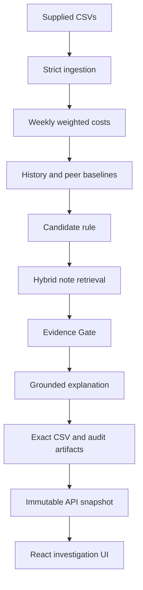
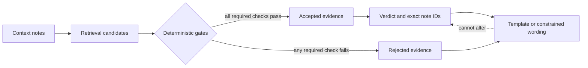
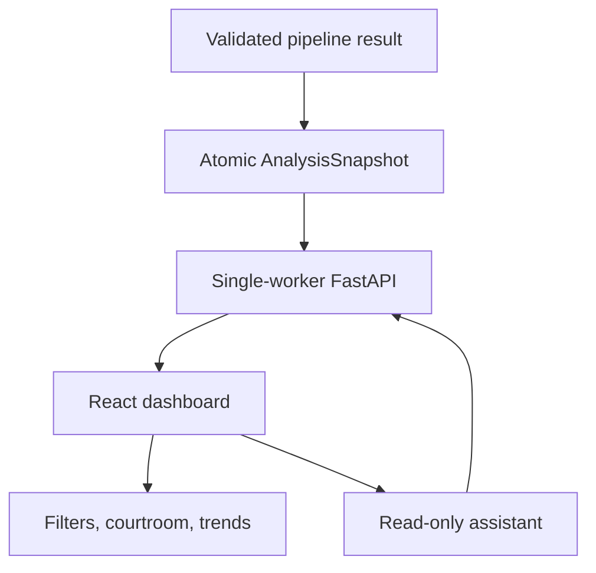

# Architecture

## System context

FreightGuard is a local, single-process case-study application. CSV inputs are
validated into typed records, deterministic services own every canonical number and
decision, and a React UI reads immutable FastAPI snapshots.

## Backend boundaries

- `domain/` defines immutable contracts and enums.
- `services/ingestion`, `analytics`, `context`, `retrieval`, and `evidence` implement
  the deterministic pipeline.
- `services/explanations` controls template, replay, and optional live wording.
- `services/root_cause` provides diagnostic decompositions without verdict authority.
- `services/assistant` maps bounded questions to read-only snapshot tools.
- `application/` orchestrates pipeline execution, publication, and snapshot queries.
- `evaluation/` independently checks contracts and three-run reproducibility.
- `api/` exposes typed HTTP routes without recalculating browser-side values.

## Evidence trust boundary

Retrieval affects which notes are examined, not which notes are accepted. A model,
when enabled, can phrase a validated evidence packet but cannot calculate values,
select note IDs, or change the verdict.

## API and frontend

One completed run is projected into a deeply immutable snapshot. Refresh failures
leave the previous snapshot active. Every endpoint returns a snapshot ID, and the UI
refuses to combine resources from different snapshots.

## Artifact ownership and failure isolation

The pipeline owns the final CSV, explanation audit, root-cause artifact, and formal
evaluation association. Publication requires a passing evaluation report whose
input hashes, configuration fingerprint, final CSV, and root-cause hash reconcile.
Temporary API runs are isolated and published only after all gates pass.

## Configuration and modes

Typed settings resolve repository-relative paths. Template mode is the canonical
offline path. Replay mode accepts only validated cached provider output. Live mode
requires explicit credentials and still passes through deterministic validation.
The API intentionally uses one worker because snapshot state is process-local.

## Fit and production evolution

Pandas and an in-memory snapshot keep the challenge implementation inspectable and
fast for 2,940 rows. A production evolution would put immutable run artifacts in
object storage, metadata in a transactional database, long-running analysis in a
job queue, and authentication/authorization at the API boundary while retaining the
same deterministic domain contracts.
